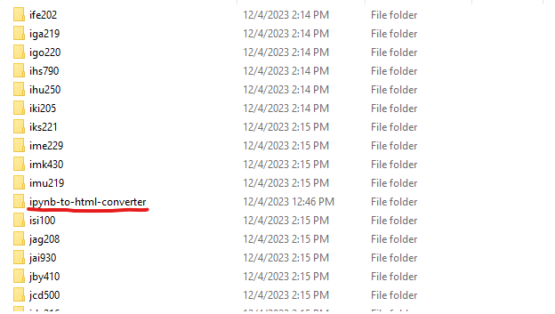

# .ipynb to .html Converter 🌐
This tool runs through a directory, and converts all .ipynb files to HTML files. You can then also use it to automate sending these HTML files to students.

## USAGE
### 1) Clone this Repo 📝
Git clone this repository into the directory you want to convert. Here's what your setup should look like:

Note: The names and locations of the .ipynb files don't matter (as long as it's in the parent directory or a subdirectory of it) when `id_mode` is set to "SCRAPE". When it's set to "FILE", however, it assumes the name of the folder it is located in to be the student's VUnet ID 

### 2) Run "RUN THIS ONE.ipynb" 🚀
Crack open the file "RUN THIS ONE.ipynb", give the cells a read, and run them in sequence. Modify the essential parameters in the final cell as needed. The must-change ones are listed in the file, but here are some optional tweaks you can make:

## Required Params 🛠
### ta_name
Your name – for signing off emails.
### ta_email
The email address from which your emails will be sent.
### ta_email_password
The password to said email address.
### assignment_number
The assignment's number or name - "Midterm", "Assignment 2", etc.

## Optional Params 🧙‍♂️
### dir_path
The path to the directory with all the files. Defaults to the dir you cloned the file into. Change at your own risk.
### file_convert
Set to True to turn .ipynb files into .html. Not much point in turning this off, since already-converted files are skipped.
### send_email
True if you want to send emails containing .html files (each is sent immedeately after .ipynb conversion).
### test_mode
Set to True for a trial run. It converts the first file and emails it to you – best practice is to ALWAYS have this on the first time you run the code.
### go_to_vunet_id
You're here because your script died halfway through sending emails due to email server timeout. Set this to the vunet ID you want to restart from. Simple as.
### id_mode
"SCRAPE" gets VUnet ID from file contents.

"FILE" gets VUnet ID based on the file's parent directory (i.e. folder name is vunet id).

## Final Notes/Quirks 📝
Outlook can be weird with automated emails - where they don't show up as "Sent", despite you sending them. As a result, the script Cc's the sender (you) in every email. To avoid a flooded inbox, set up a folder in Outlook for emails sent by yourself that contain "Feedback and Results" in the title. This way, you don't end up with 450+ emails in your inbox.